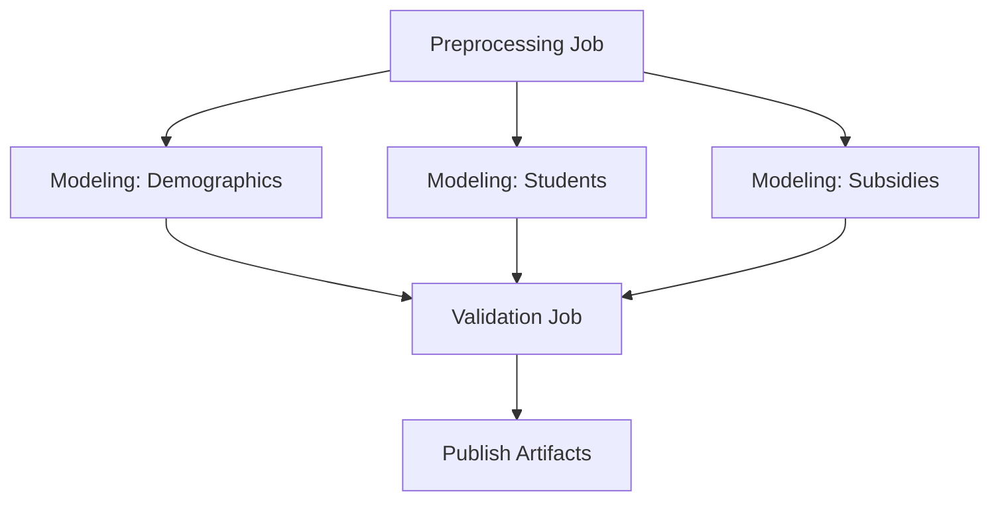

# Amsterdam ML Forecasting Pipeline

Machine learning project for forecasting demographics, student enrollment, and subsidies in the Amsterdam region.

## Project Structure

```
PROJECT_AMSTERDAM_presque/
├── DATA/                              # Raw data files
│   ├── Amsterdam Region districts and neigbourhood data.xlsx
│   ├── amsterdam_subsidies_all_english.xlsx
│   └── Students per education type Amsterdam.csv
│
├── PREPROCESSING/                     # Data cleaning notebooks
│   ├── demographic.ipynb             # Process district/neighborhood demographics
│   ├── students.ipynb                # Process student enrollment data
│   └── subsidies.ipynb               # Process subsidy allocations
│
├── data_clean/                        # Preprocessed data (generated)
│   ├── demographics.csv
│   ├── students.csv
│   └── subsidies.csv
│
├── MODEL/                             # Forecasting notebooks
│   ├── forecasting_demographic.ipynb # Demographic forecasts (2026-2028)
│   ├── forecasting_students.ipynb    # Student enrollment forecasts
│   └── forecasting_subsidies.ipynb   # Subsidy forecasts using ARIMA
│
├── TRANSFORMATION/                    # Final forecasts (generated)
│   ├── forecast_demographic.csv
│   └── forecast_subsidy_final.csv
│
├── ci/                                # CI/CD validation scripts
│   └── validate_outputs.py           # Output validation logic
│
├── .github/workflows/
│   └── mlops-pipeline.yml            # GitHub Actions MLOps pipeline
│
└── requirements.txt                   # Python dependencies
```

## ML Pipeline Steps

### 1. Data Preprocessing
Cleans and transforms raw data into analysis-ready formats:

- **Demographics**: Parses multi-year Excel sheets, normalizes column names, calculates growth rates and education/care indicators
- **Students**: Reshapes wide-format CSV to long format, cleans year values, handles missing data
- **Subsidies**: Filters Care/Education subsidies, aggregates by year and policy area, calculates year-over-year changes

**Output**: Three CSV files in `data_clean/`

### 2. Forecasting Models
Generates 3-year forecasts (2026-2028) using time series models:

- **Demographics**: Evaluates Drift, OLS, and Exponential Smoothing models per neighborhood/indicator, selects best model by MAE
- **Students**: Applies forecasting models to enrollment trends by education type
- **Subsidies**: Compares Linear Regression, Holt-Winters, and ARIMA models; uses ARIMA(1,1,1) for final forecasts

**Output**: Forecast CSV files in `TRANSFORMATION/`

### 3. Validation
Validates pipeline outputs:
- Checks all required files exist and are non-empty
- Verifies expected columns are present
- Ensures data contains rows

## Running Locally

### Prerequisites
- Python 3.11+
- Jupyter

### Setup
```bash
pip install -r requirements.txt
```

### Execute Pipeline
```bash
# Step 1: Preprocessing
jupyter nbconvert --to notebook --execute --inplace PREPROCESSING/demographic.ipynb --ExecutePreprocessor.cwd=PREPROCESSING
jupyter nbconvert --to notebook --execute --inplace PREPROCESSING/students.ipynb --ExecutePreprocessor.cwd=PREPROCESSING
jupyter nbconvert --to notebook --execute --inplace PREPROCESSING/subsidies.ipynb --ExecutePreprocessor.cwd=PREPROCESSING

# Step 2: Modeling
jupyter nbconvert --to notebook --execute --inplace MODEL/forecasting_demographic.ipynb --ExecutePreprocessor.cwd=MODEL
jupyter nbconvert --to notebook --execute --inplace MODEL/forecasting_students.ipynb --ExecutePreprocessor.cwd=MODEL
jupyter nbconvert --to notebook --execute --inplace MODEL/forecasting_subsidies.ipynb --ExecutePreprocessor.cwd=MODEL

# Step 3: Validation
python ci/validate_outputs.py
```

## CI/CD with GitHub Actions

The MLOps pipeline automatically runs on every push to `main` or pull request.

### Pipeline Architecture



### Job Details

| Job | Description | Dependencies | Runs |
|-----|-------------|--------------|------|
| **preprocessing** | Executes all 3 preprocessing notebooks sequentially | None | Always |
| **modeling-demographic** | Runs demographic forecasting | preprocessing | In parallel |
| **modeling-students** | Runs student forecasting | preprocessing | In parallel |
| **modeling-subsidies** | Runs subsidy forecasting | preprocessing | In parallel |
| **validate** | Validates all outputs exist and have correct schema | All modeling jobs | Always |
| **publish-artifacts** | Uploads final artifacts (30-day retention) | validate | Only on `main` branch |

### Parallelization
The three modeling jobs run in parallel after preprocessing completes, reducing total pipeline execution time.

### Artifacts
- **Intermediate artifacts** (1-day retention): Passed between jobs
- **Final artifacts** (30-day retention): Published from `publish-artifacts` job
  - All cleaned CSV files from `data_clean/`
  - All forecast CSV files from `TRANSFORMATION/`

### Monitoring
View pipeline runs at: `https://github.com/YOUR_USERNAME/YOUR_REPO/actions`

## Models Used

### Demographics Forecasting
- **Drift Model**: Linear extrapolation from first to last value
- **OLS Model**: Ordinary Least Squares linear regression
- **Exponential Smoothing**: Time series smoothing with trend
- **Selection**: Best model chosen per neighborhood/indicator based on rolling validation MAE

### Subsidies Forecasting
- **Linear Regression**: Baseline trend model
- **Holt-Winters**: Exponential smoothing with additive trend
- **ARIMA(1,1,1)**: Autoregressive Integrated Moving Average
- **Selection**: ARIMA selected based on lowest MAPE on 2023-2025 test set

## Metrics
- **MAE** (Mean Absolute Error): Average absolute difference between predictions and actuals
- **RMSE** (Root Mean Squared Error): Square root of average squared errors
- **MAPE** (Mean Absolute Percentage Error): Average percentage error

## Contributing
When adding notebooks or changing outputs:
1. Update `ci/validate_outputs.py` with new file paths and required columns
2. Test locally before pushing
3. Monitor GitHub Actions for pipeline success

## License
Internal project - Amsterdam AI Institute
